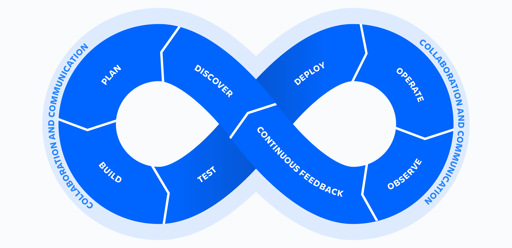

<!-- ------------------------------------------------------------ ---

This file (on GitHub):

	https://github.com/mcavallo-git/Coding#coding

--- ------------------------------------------------------------- -->

<h3 id="coding">DevOps Resource Reference</h3>

<i>What is DevOps?</i>

	 
	
Wikipedia&nbsp;<a href="https://en.wikipedia.org/wiki/DevOps">[1]</a> states:

	<blockquote>DevOps is a set of practices that combines software development (Dev) and information-technology operations (Ops) which aims to shorten the systems development life cycle and provide continuous delivery with high software quality.</blockquote>
	
Atlassian&nbsp;<a href="https://www.atlassian.com/devops">[4]</a> states:

	<blockquote>DevOps is a set of practices that automates the processes between software development and IT teams, in order that they can build, test, and release software faster and more reliably.</blockquote>

<!-- ------------------------------------------------------------ -->

<h5>Sync PowerShell Modules</h5>

<i>Show/Hide Content</i>

	

		<ol>
			<li>
				
Prereq: Git SCM - <a href="https://git-scm.com/download/win">Download (source)</a>

			</li>
			<li>
				

						Prereq: Git CLI added to PATH (available during installation of Git SCM - click to view screenshot)
					

					

				

			</li>
			<li>Prereq: PowerShell Terminal w/ Elevated Privileges, e.g. in "Run as Admin" mode</li>
			<li>
				
If Pre-Reqs are met, run the following command to sync PowerShell Modules:

				<pre><code>Start-Process PowerShell.exe $(New-Object Net.WebClient).DownloadString('https://sync.mcavallo.com/ps') -Verb RunAs;</code></pre>
			</li>
		</ol>
	

<!-- ------------------------------------------------------------ -->

<h5>Sync Bash Modules</h5>

<i>Show/Hide Content</i>

	

		<ol>
			<li>Prereq: Debian-based Linux environment (Ubuntu, Raspbian, Debian, etc.)</li>
			<li>Prereq: SSH Terminal w/ Elevated Privileges, e.g. running as "root" user (or as any sudoer)</li>
			<li>
				
If Pre-Reqs are met, run the following command to sync Bash Modules: 

				<pre><code>curl -ssL "https://sync.mcavallo.com/$(date +'%N').sh" | sudo bash;</code></pre>
			</li>
		</ol>
	

<!-- ------------------------------------------------------------ -->

<h5 id="software">Software</h5>

<i>Show/Hide Content</i>

 

<table>
<tr><th>Name &nbsp;&nbsp;&nbsp;<i>Description</i></th><th>Source  &nbsp;&nbsp;&nbsp;<i>Docs, etc.</i></th></tr>
<tr><th colspan="2"><h6 id="esssentials">💿 Esssentials</h6></th></tr>
<tr><td>**AirParrot**  &nbsp;&nbsp;&nbsp;<i>Airplay Client for Windows</i></td><td><a href="https://www.airsquirrels.com/airparrot/download/">Download (mirror)</a></td></tr>
<tr><td>**AutoHotkey (AHK)**  &nbsp;&nbsp;&nbsp;<i>Keyboard Macro Program</i></td><td><a href="https://www.autohotkey.com/download/ahk-install.exe">Download (source)</a></td></tr>
<tr><td>**Classic Shell**  &nbsp;&nbsp;&nbsp;<i>Win7 Style Start-Menu</i></td><td><a href="https://www.fosshub.com/Classic-Shell.html">Download (mirror)](https://www.softpedia.com/get/Desktop-Enhancements/Shell-Replacements/Classic-Shell.shtml) &nbsp;&nbsp;&nbsp;[Download (fallback)</a></td></tr>
<tr><td>**Cryptomator**  &nbsp;&nbsp;&nbsp;<i>Client-Side Cloud-Encryption</i></td><td><a href="https://cryptomator.org/downloads/#winDownload">Download (mirror)</a></td></tr>
<tr><td>**Docker Desktop (for Windows)**  &nbsp;&nbsp;&nbsp;<i>Containers</i></td><td><a href="https://download.docker.com/win/stable/Docker%20for%20Windows%20Installer.exe">Download (source)</a></td></tr>
<tr><td>**Effective File Search (EFS)**  &nbsp;&nbsp;&nbsp;<i>Search tool</i></td><td><a href="https://effective-file-search.en.lo4d.com/download">Download (mirror)](https://www.softpedia.com/get/System/File-Management/Effective-File-Search.shtml#download) &nbsp;&nbsp;&nbsp;[Download (fallback)</a></td></tr>
<tr><td>**FoxIt PhantomPDF**  &nbsp;&nbsp;&nbsp;<i>PDF Editor (Paid)</i></td><td><a href="https://www.foxitsoftware.com/downloads/#Foxit-PhantomPDF-Standard/">Download (source)</a></td></tr>
<tr><td>**Git SCM**  &nbsp;&nbsp;&nbsp;<i>CLI Integration</i></td><td><a href="https://git-scm.com/download/win">Download (source)</a></td></tr>
<tr><td>**GitHub Desktop**  &nbsp;&nbsp;&nbsp;<i>Git Daily Driver</i></td><td><a href="https://desktop.github.com">Download (source)</a></td></tr>
<tr><td>**Gpg4win**  &nbsp;&nbsp;&nbsp;<i>GnuPG for Windows</i></td><td><a href="https://www.gpg4win.org/thanks-for-download.html">Download (source)</a></td></tr>
<tr><td>**Handbrake**  &nbsp;&nbsp;&nbsp;<i>Media Transcoder</i></td><td><a href="https://handbrake.fr/">Download (source)</a></td></tr>
<tr><td>**ImageMagick**  &nbsp;&nbsp;&nbsp;<i>Image Editing via Command-Line</i></td><td><a href="https://www.imagemagick.org/script/download.php#windows">Download (source)</a></td></tr>
<tr><td>**KDiff3**  &nbsp;&nbsp;&nbsp;<i>Text Difference Analyzer</i></td><td><a href="https://sourceforge.net/projects/kdiff3/">Download (source)</a></td></tr>
<tr><td>**LastPass**  &nbsp;&nbsp;&nbsp;<i>Password Manager</i></td><td><a href="https://lastpass.com/download">Download (source)</a></td></tr>
<tr><td>**Microsoft Office 365**  &nbsp;&nbsp;&nbsp;<i>Outlook, Word, Excel, PowerPoint, etc.</i></td><td><a href="https://www.office.com/">Download (source)</a> &nbsp;&nbsp;&nbsp;<i>Login &rarr; Click "Install Office"</i></td></tr>
<tr><td>**MobaXterm**  &nbsp;&nbsp;&nbsp;<i>XServer for Windows</i></td><td><a href="https://mobaxterm.mobatek.net/download-home-edition.html">Download (source)</a></td></tr>
<tr><td>**Ninite Package Manager**  &nbsp;&nbsp;&nbsp;<i>Includes 7-Zip, Audacity, Chrome, Classic Shell, &nbsp;&nbsp;&nbsp;DropBox, FileZilla, FireFox, GreenShot, HandBrake, &nbsp;&nbsp;&nbsp;NotePad++, Paint.Net, VLC, VS-Code, & WinDirStat</i></td><td><a href="https://ninite.com/7zip-audacity-chrome-classicstart-dropbox-filezilla-firefox-greenshot-handbrake-notepadplusplus-paint.net-vlc-vscode-windirstat/">Download (source)</a></td></tr>
<tr><td>**Notepad++**  &nbsp;&nbsp;&nbsp;<i>Text and Source-Code Editor</i></td><td><a href="https://notepad-plus-plus.org/downloads/">Download (source)</a></td></tr>
<tr><td>**Notepad Replacer**  &nbsp;&nbsp;&nbsp;<i>Redirects NotePad.exe to VSCode, NP++, etc.</i></td><td><a href="https://www.binaryfortress.com/NotepadReplacer/Download/">Download (source)</a></td></tr>
<tr><td>**Reflector**  &nbsp;&nbsp;&nbsp;<i>Airplay Server for Windows</i></td><td><a href="https://www.airsquirrels.com/reflector">Download (mirror)</a></td></tr>
<tr><td>**Remote Mouse**  &nbsp;&nbsp;&nbsp;<i>Remote Mouse & Keyboard control via Phone</i></td><td><a href="https://www.remotemouse.net/downloads/RemoteMouse.exe">Download (source)</a></td></tr>
<tr><td>**Royal TS**  &nbsp;&nbsp;&nbsp;<i>Includes Tools to manage Hyper-V, RDP, &nbsp;&nbsp;&nbsp;SSH, SFTP, Teamviewer, VMware, & more</i></td><td><a href="https://www.royalapps.com/ts/win/download">Download (mirror)</a></td></tr>
<tr><td>**Splashtop Personal**  &nbsp;&nbsp;&nbsp;<i>Remote Access Client</i></td><td><a href="https://www.splashtop.com/downloadstart?product=stp&platform=windows-client">Download (source)</a></td></tr>
<tr><td>**Splashtop Streamer**  &nbsp;&nbsp;&nbsp;<i>Remote Access Host/Server</i></td><td><a href="https://www.splashtop.com/downloadstart?platform=windows">Download (source)</a></td></tr>
<tr><td>**Teamviewer**  &nbsp;&nbsp;&nbsp;<i>Remote Access Host/Server</i></td><td><a href="https://www.teamviewer.com/en/download/windows/">Download (source)</a></td></tr>
<tr><td>**Tortoise Git**  &nbsp;&nbsp;&nbsp;<i>Git Merge Conflict Resolver</i></td><td><a href="https://tortoisegit.org/download">Download (source)</a></td></tr>
<tr><td>**Visual Studio Code**  &nbsp;&nbsp;&nbsp;<i>VS Code - Code Editor</i></td><td><a href="https://code.visualstudio.com/download">Download (source)</a></td></tr>
<tr><td>**WinDirStat**  &nbsp;&nbsp;&nbsp;<i>Disk Usage Analyzer</i></td><td><a href="https://www.fosshub.com/WinDirStat.html">Download (source)](https://windirstat.net/download.html) &nbsp;&nbsp;&nbsp;[Download (fallback)</a></td></tr>
<tr><td>**Windows 10**  &nbsp;&nbsp;&nbsp;<i>Installation Media Creation Tool</i></td><td><a href="https://www.microsoft.com/en-us/software-download/windows10">Download (source)</a></td></tr>
<tr><th colspan="2"><h6 id="benchmarking">💿 Benchmarking</h6></th></tr>
<tr><td>**CrystalDiskMark**  &nbsp;&nbsp;&nbsp;<i>HDD/SSD Benchmarking</i></td><td><a href="https://crystalmark.info/en/download/">Download (source)</a></td></tr>
<tr><td>**Unigine Benchmarks**  &nbsp;&nbsp;&nbsp;<i>GPU Benchmarking</i></td><td><a href="https://benchmark.unigine.com/">Download (source)</a></td></tr>
<tr><th colspan="2"><h6 id="communication">💿 Communication</h6></th></tr>
<tr><td>**Discord**  &nbsp;&nbsp;&nbsp;<i>VoIP & Digital Distribution</i></td><td><a href="https://discordapp.com/download">Download (source)</a></td></tr>
<tr><td>**Microsoft Teams**  &nbsp;&nbsp;&nbsp;<i>Shared Workspace for Chat, App, and File-Sharing</i></td><td><a href="https://products.office.com/en-us/microsoft-teams/download-app">Download (source)</a></td></tr>
<tr><td>**Skype**  &nbsp;&nbsp;&nbsp;<i>Free Video & Voice Calls</i></td><td><a href="https://www.skype.com/en/get-skype/">Download (source)</a></td></tr>
<tr><td>**Skype for Business**  &nbsp;&nbsp;&nbsp;<i><a href="https://support.microsoft.com/en-us/help/4511540/retirement-of-skype-for-business-online">Services will be retired (inaccessible) on/after July 31, 2021</a></i></td><td><a href="https://products.office.com/en-us/skype-for-business/download-app">Download (source)</a></td></tr>
<tr><th colspan="2"><h6 id="cross-platform">💿 Cross-Platform</h6></th></tr>
<tr><td>**Amazon Web Services CLI** <i>(e.g. "AWS CLI")</i>  &nbsp;&nbsp;&nbsp;<i>Manage & Administer Cloud Services via CLI</i></td><td><a href="https://docs.aws.amazon.com/powershell/latest/reference/Index.html">Download (source)](https://aws.amazon.com/powershell) &nbsp;&nbsp;&nbsp;[Download (PS-gallery)](https://www.powershellgallery.com/packages/AWSPowerShell) &nbsp;&nbsp;&nbsp;[View Documentation</a></td></tr>
<tr><td>**Azure CLI**  &nbsp;&nbsp;&nbsp;<i>Manage & Administer Cloud Services via CLI</i></td><td><a href="https://docs.microsoft.com/en-us/cli/azure/reference-index">Download (source)](https://aka.ms/installazurecliwindows) &nbsp;&nbsp;&nbsp;[Download (PS-gallery)](https://www.powershellgallery.com/packages/az) &nbsp;&nbsp;&nbsp;[View Documentation</a></td></tr>
<tr><td>**Docker**  &nbsp;&nbsp;&nbsp;<i>Linux LXC Containers</i></td><td><a href="https://get.docker.com">View (source)</a></td></tr>
<tr><td>**Java Standard Edition (SE8)**  &nbsp;&nbsp;&nbsp;<i>JDK - Development-Kit &nbsp;&nbsp;&nbsp;JRE - Runtime Environment &nbsp;&nbsp;&nbsp;Server JRE - For Long-Running Services</i></td><td><a href="https://www.oracle.com/technetwork/java/javase/downloads/index.html#JDK8">Download (source)</a></td></tr>
<tr><td>**PowerShell Core**  &nbsp;&nbsp;&nbsp;<i>Standard Edition</i></td><td><a href="https://docs.microsoft.com/en-us/powershell/scripting/install/installing-powershell-core-on-linux">Download (GitHub)](https://github.com/PowerShell/PowerShell#get-powershell) &nbsp;&nbsp;&nbsp;[Download (Microsoft)</a></td></tr>
<tr><td>**WSL - All Distros**  &nbsp;&nbsp;&nbsp;<i>Windows Subsystem for Linux</i></td><td><a href="https://aka.ms/wslstore">Download (source)</a></td></tr>
<tr><td>**WSL - Ubuntu 18.04 LTS**  &nbsp;&nbsp;&nbsp;<i>Windows Subsystem for Linux</i></td><td><a href="https://www.microsoft.com/store/productId/9N9TNGVNDL3Q">Download (source)</a></td></tr>
<tr><th colspan="2"><h6 id="dns">💿 DNS</h6></th></tr>
<tr><td>**GoDaddy - Certificate Authority (CA) Bundles** <i> &nbsp;&nbsp;&nbsp;Root & Intermediate Certificates</i></td><td><a href="https://ssl-ccp.godaddy.com/repository?origin=CALLISTO">Download (source)</a> &nbsp;&nbsp;&nbsp;<a href="https://www.namecheap.com/support/knowledgebase/article.aspx/986/69/what-is-ca-bundle" title="A 'CA bundle' is a file that contains root and intermediate certificates. The end-entity certificate along with a CA bundle constitutes the certificate chain.">What is a CA bundle?</a></td></tr>
<tr><td>**Namecheap - Certificate Authority (CA) Bundles** <i> &nbsp;&nbsp;&nbsp;Root & Intermediate Certificates</i></td><td><a href="https://www.namecheap.com/support/knowledgebase/article.aspx/9393/69/where-do-i-find-ssl-ca-bundle">Download (source)</a> &nbsp;&nbsp;&nbsp;<a href="https://www.namecheap.com/support/knowledgebase/article.aspx/986/69/what-is-ca-bundle" title="A 'CA bundle' is a file that contains root and intermediate certificates. The end-entity certificate along with a CA bundle constitutes the certificate chain.">What is a CA bundle?</a></td></tr>
<tr><th colspan="2"><h6 id="entertainment">💿 Entertainment</h6></th></tr>
<tr><td>**Spotify**  &nbsp;&nbsp;&nbsp;<i>Music Streaming</i></td><td><a href="https://www.spotify.com/us/download/other/">Download (source)</a></td></tr>
<tr><td>**Twitch App**  &nbsp;&nbsp;&nbsp;<i>Live-Streaming & Mod Management</i></td><td><a href="https://twitch.tv/downloads">Download (source)</a></td></tr>
<tr><th colspan="2"><h6 id="hardware-utilities">💿 Hardware Utilities</h6></th></tr>
<tr><td>**ASUS Aura Sync**  &nbsp;&nbsp;&nbsp;<i>RGB Controller</i></td><td><a href="https://www.asus.com/campaign/aura/us/download.html">Download (source)</a></td></tr>
<tr><td>**BalenaEtcher**  &nbsp;&nbsp;&nbsp;<i>Drive Imaging Utility (.iso & .img, especially)</i></td><td><a href="https://www.balena.io/etcher/">Download (source)</a></td></tr>
<tr><td>**Corsair iCue**  &nbsp;&nbsp;&nbsp;<i>RGB Controller (+ Aura API)</i></td><td><a href="https://www.corsair.com/us/en/downloads">Download (source)</a></td></tr>
<tr><td>**Easy2Boot**  &nbsp;&nbsp;&nbsp;<i>USB-drive multiboot software</i></td><td><a href="https://www.fosshub.com/Easy2Boot.html">Download (source)</a></td></tr>
<tr><td>**Intel® DSA**  &nbsp;&nbsp;&nbsp;<i>Intel® Driver & Support Assistant</i></td><td><a href="https://www.intel.com/content/www/us/en/support/detect.html">Download (source)</a></td></tr>
<tr><td>**LG OnScreen Control**  &nbsp;&nbsp;&nbsp;<i>Driver + Software for <a href="https://www.lg.com/uk/support/support-product/lg-34UC88-B"> LG 34UC88-B ] Display/Monitor</i></td><td>[Download (source)](http://gscs-b2c.lge.com/downloadFile?fileId=L6Ns5WE6jhENU8Q3PwSyw) &nbsp;&nbsp;&nbsp;[View Drivers & Software</a></td></tr>
<tr><td>**Logitech G Hub**  &nbsp;&nbsp;&nbsp;<i>Keyboard/Mouse RGB (+3rd Party Tools)</i></td><td><a href="https://support.logi.com/hc/en-us/articles/360025298133">Download (source)</a></td></tr>
<tr><td>**Logitech SetPoint**  &nbsp;&nbsp;&nbsp;<i>Mouse/Keyboard Hotkey Manager</i></td><td><a href="http://support.logitech.com/software/setpoint">Download (source)</a></td></tr>
<tr><td>**PCPartPicker**  &nbsp;&nbsp;&nbsp;<i>Component Pricing/Compatibility Comparisons</i></td><td><a href="https://pcpartpicker.com/user/cavalol/saved/7Q2Mcf">Open (web-service)</a></td></tr>
<tr><td>**RMPrepUSB**  &nbsp;&nbsp;&nbsp;<i>Allows users to easily and quickly 'roll their own' multiboot USB drive</i></td><td><a href="https://www.fosshub.com/RMPrepUSB.html">Download (source)</a></td></tr>
<tr><td>**VMware (ESXi Server Management)**  &nbsp;&nbsp;&nbsp;<i>VMware vSphere, VMware Workstation, VMware Fusion, VMware Player, etc.</i></td><td><a href="https://my.vmware.com/web/vmware/downloads">Download (source)</a></td></tr>
<tr><td>**Yubico Tools**  &nbsp;&nbsp;&nbsp;<i>Security Key Configuration</i></td><td><a href="https://www.yubico.com/products/services-software/download/">Download (source)</a></td></tr>
<tr><td>**WinSW: Windows service wrapper**  &nbsp;&nbsp;&nbsp;<i>(in less restrictive license)</i></td><td><a href="https://github.com/kohsuke/winsw/">Download (source)</a></td></tr>
<tr><th colspan="2"><h6 id="monitoring">💿 Monitoring</h6></th></tr>
<tr><td>**CoreTemp**  &nbsp;&nbsp;&nbsp;<i>CPU temperature monitoring/logging</i></td><td><a href="https://www.alcpu.com/CoreTemp/">Download (source)</a></td></tr>
<tr><td>**CrystalDiskInfo**  &nbsp;&nbsp;&nbsp;<i>HDD temperature & S.M.A.R.T. value monitoring</i></td><td><a href="https://crystalmark.info/en/download/">Download (source)</a></td></tr>
<tr><th colspan="2"><h6 id="personalization">💿 Personalization</h6></th></tr>
<tr><td>**Lockscreen as wallpaper**  &nbsp;&nbsp;&nbsp;<i>Mirrors LockScreen Background onto Desktop</i></td><td><a href="https://www.microsoft.com/store/productId/9NBLGGH4WR7C">Download (source)</a></td></tr>
<tr><th colspan="2"><h6 id="server-runtimes">💿 Server Runtimes</h6></th></tr>
<tr><td>**Docker - Containerized**  &nbsp;&nbsp;&nbsp;<i>Linux LXC Container Management</i></td><td><a href="https://get.docker.com">View (source)</a></td></tr>
<tr><td>**Jenkins - CI/CD Server**  &nbsp;&nbsp;&nbsp;<i>Automates Continuous Integration (CI) &nbsp;&nbsp;&nbsp;Facilitates Continuous-Deployment (CD)</i></td><td><a href="https://jenkins.io">View (source)</a></td></tr>
<tr><th colspan="2"><h6 id="troubleshooting">💿 Troubleshooting</h6></th></tr>
<tr><td>**BlueScreenView**  &nbsp;&nbsp;&nbsp;<i>by Nirsoft</i></td><td><a href="https://www.nirsoft.net/utils/blue_screen_view.html">Download (source)</a></td></tr>
<tr><td>**DigiCert Certificate Utility for Windows**  &nbsp;&nbsp;&nbsp;<i>Certificate Management & Troubleshooting Tool</i></td><td><a href="https://www.digicert.com/util/">Download (source)</a></td></tr>
<tr><td>**DDU (Display Driver Uninstaller)**  &nbsp;&nbsp;&nbsp;<i>Removes ALL graphics drivers</i></td><td><a href="https://www.guru3d.com/files-details/display-driver-uninstaller-download.html">Download (source)</a></td></tr>
<tr><td>**DigiCert SSL Tools**  &nbsp;&nbsp;&nbsp;<i>Check Host SSL/TLS, Generate CSR, Check CSR, Searct CT Logs</i></td><td><a href="https://ssltools.digicert.com/checker/">Open (web-service)</a></td></tr>
<tr><td>**FindLinks**  &nbsp;&nbsp;&nbsp;<i>by Sysinternals</i></td><td><a href="https://docs.microsoft.com/en-us/sysinternals/downloads/findlinks">Download (source)</a></td></tr>
<tr><td>**ImmuniWeb SSLScan (HTTPS)**  &nbsp;&nbsp;&nbsp;<i>Application Security Testing (AST) & Attack Surface Management (ASM)</i></td><td><a href="https://www.immuniweb.com/ssl/API_documentation.pdf">Open (web-service)](https://www.htbridge.com/ssl/) &nbsp;&nbsp;&nbsp;[View API Documentation</a></td></tr>
<tr><td>**Malwarebytes**  &nbsp;&nbsp;&nbsp;<i>Anti-Malware Utility</i></td><td><a href="https://www.malwarebytes.com/mwb-download/thankyou/">Download (source)</a></td></tr>
<tr><td>**Postman**  &nbsp;&nbsp;&nbsp;<i>'API-Development Collaboration Platform' - HTTP <a href="https://www.getpostman.com/downloads"> GET/OPTION/POST/etc. ] Request Debugger</i></td><td>[Download (mirror)</a></td></tr>
<tr><td>**ProduKey**  &nbsp;&nbsp;&nbsp;<i>by Nirsoft (Recover lost Windows product key (CD-Key) and Office 2003/2007 product key)</i></td><td><a href="https://www.nirsoft.net/utils/product_cd_key_viewer.html">Download (source)</a></td></tr>
<tr><td>**Process Explorer**  &nbsp;&nbsp;&nbsp;<i>by Sysinternals</i></td><td><a href="https://docs.microsoft.com/en-us/sysinternals/downloads/process-explorer">Download (source)</a></td></tr>
<tr><td>**Qualys SSL Server Test (HTTPS)**  &nbsp;&nbsp;&nbsp;<i>Application Security Testing (AST) & Attack Surface Management (ASM)</i></td><td><a href="https://www.ssllabs.com/ssltest/">Open (web-service)</a></td></tr>
<tr><td>**TCPView**  &nbsp;&nbsp;&nbsp;<i>by Sysinternals</i></td><td><a href="https://docs.microsoft.com/en-us/sysinternals/downloads/tcpview">Download (source)</a></td></tr>
<tr><td>**WakeMeOnLan**  &nbsp;&nbsp;&nbsp;<i>by Nirsoft</i></td><td><a href="https://www.nirsoft.net/utils/wake_on_lan.html">Download (source)</a></td></tr>
<tr><td>**WinTail**  &nbsp;&nbsp;&nbsp;<i>Tail for Windows</i></td><td><a href="https://sourceforge.net/projects/wintail/">Download (source)</a></td></tr>
</table>

<!-- ------------------------------------------------------------ -->

<li>
	<strong><a href="https://github.com/mcavallo-git/Coding/tree/master/windows#workstation-installs">(Continued) Windows Tips/Tricks</a></strong>
</li>

<!-- ------------------------------------------------------------ -->

<h3>Citation(s)</h3>

<i>Show/Hide Content</i>

* ###### [1] en.wikipedia.org  |  "DevOps"  |  https://en.wikipedia.org/wiki/DevOps

* ###### [2] reddit.com  |  "What application do you always install on your computer and recommend to everyone?"  |  https://www.reddit.com/r/AskReddit/comments/4g5sl1/what_application_do_you_always_install_on_your/

* ###### [3] reddit.com  |  "[List] Essential Software for your Windows PC"  |  https://www.reddit.com/r/software/comments/8tx8w7/list_essential_software_for_your_windows_pc/

* ###### [4] atlassian.com  |  "DevOps: Breaking the Development-Operations barrier"  |  https://www.atlassian.com/devops

<!-- ------------------------------------------------------------ -->