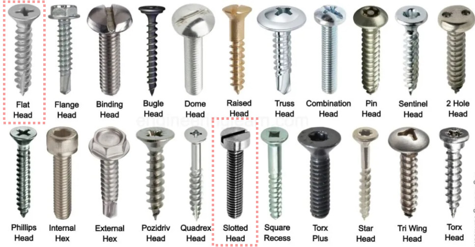
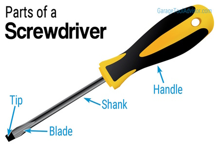
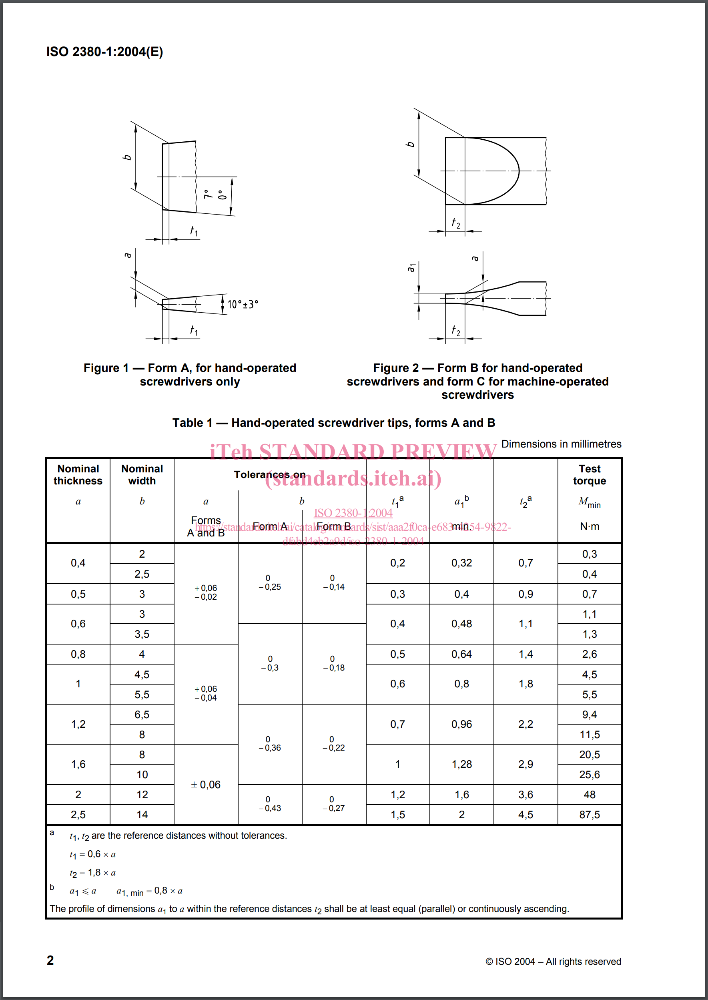

  <!-- https://github.com/mcavallo-git/Coding/blob/main/hardware/screws-screwdrivers/slotted-standard_flathead-is-type-of-head_shape_dimensions-sizes.md -->

# Screw/Screwdriver Dimensions, Sizes

***

- ## `Slotted` (aka `Standard`) Screws & Drive Tools

  ***

  - ### ❗ Word of Warning
    - The term `flat-head` has nothing to do with the *drive type* of a screw
      - `Slotted` (or `Standard`) is the correct term to use when describing screws whose drive type is a simple line across the diameter of the screw head
        

💬 (Click to show/hide additional info)

        - ✅ `Flat-head screws` **DO** define a specific screw head/shank geometry
          - Specifically, `flat-head screws` are ones which mate flushly with the surface they're being screwed into
          - 

💬 (Click to show/hide common screw head types)

        - ❌ `Flat-head screws` do **NOT** define the driver required to drive the head of a screw
          - E.g. The `flat-head` adjective attached to the noun `screw` says **nothing** about the type of driver (screwdriver, driver bit, etc.) required to screw in said screw
        - Therefore, when attempting to reference a `slotted` or `standard` driver type (*especially* when discussing screws and not drivers), it is best to avoid usage of the term `flat-head` unless you're using the term to define the required mounting flushness of the head of the screw (and not the driver required)
    
    

    ***
  - ### Measuring a Slotted Screwdriver
      
      ***
      - #### <u>3-Value</u> Slotted Screwdriver Dimension Notation
        - Syntax:
          - <kbd><kbd style="font-size:150%">Tip-Thickness</kbd> x <kbd style="font-size:150%">Tip-Width</kbd> x <kbd style="font-size:150%">Shank-Length</kbd></kbd>
        - Example:
          - [`0.8 x 4.0 x 100mm Slotted Screwdriver`](https://www.amazon.com/s?k=0.8+x+4.0+x+100mm+Slotted+Screwdriver)
      ***
      - #### <u>2-Value</u> Slotted Screwdriver Dimension Notation
        - Syntax:
          - <kbd><kbd style="font-size:150%">Tip-Width</kbd> x <kbd style="font-size:150%">Shank-Length</kbd></kbd>
        - Example:
          - [`1/8" x 4" Slotted Screwdriver`](https://www.amazon.com/s?k=1%2F8%22+x+4%22+Slotted+Screwdriver)
        - Note:
        - ##### Determining `Tip-Thickness` from 2-Value Notation Dimensions
          - Note: If only two dimension values are given, then `Tip-Thickness` has been excluded from the stated dimensions. This is commonly done for ISO 2380-1 compliant screwdrivers.
          - If the driver <u>is</u> determined to be ISO 2380-1 compliant:
            - Use `Table 1` in `ISO 2380-1` (below) to perform a reverse lookup of the `Tip-Thickness` by first locating the known `Tip-Width`, then getting the value for the corresponding `Tip-Thickness` (in the same row)
      ***
    - #### ISO 2380-1 - Standardized Tip Dimensions for Slotted Screwdriver
      - 
        - Citation: [`ISO 2380-1:2004 (Assembly tools for screws and nuts - Screwdrivers for slotted-head screws - Part 1: Tips for hand- and machine-operated screwdrivers)`](https://cdn.standards.iteh.ai/samples/35869/8172b254f966470ab774a4c0a99231a2/ISO-2380-1-2004.pdf)
          - Refer to `Table 1 — Hand-operated screwdriver tips, forms A and B`
    ***
  - ### <u>Standardized</u> Size Chart - `Standard Slot Screwdriver Sizes (ISO 2380-1)`
    - | Measurement Offset from Edge of Tip (*`t1a`*) | Tip Thickness (*`a`*) | Tip Width (*`b`*) | Width Shorthand |
      | --------------------------------------------: | --------------------: | ----------------: | --------------: |
      |                                      `0.2 mm` |              `0.4 mm` |          `2.0 mm` |           `SL2` |
      |                                      `0.2 mm` |              `0.4 mm` |          `2.5 mm` |                 |
      |                                      `0.3 mm` |              `0.5 mm` |          `3.0 mm` |           `SL3` |
      |                                      `0.4 mm` |              `0.6 mm` |          `3.0 mm` |           `SL3` |
      |                                      `0.4 mm` |              `0.6 mm` |          `3.5 mm` |                 |
      |                                      `0.5 mm` |              `0.8 mm` |          `4.0 mm` |           `SL4` |
      |                                      `0.6 mm` |              `1.0 mm` |          `4.5 mm` |                 |
      |                                      `0.6 mm` |              `1.0 mm` |          `5.5 mm` |                 |
      |                                      `0.7 mm` |              `1.2 mm` |          `6.5 mm` |                 |
      |                                      `0.7 mm` |              `1.2 mm` |          `8.0 mm` |                 |
      |                                      `1.0 mm` |              `1.6 mm` |          `8.0 mm` |                 |
      |                                      `1.0 mm` |              `1.6 mm` |         `10.0 mm` |                 |
      |                                      `1.2 mm` |              `2.0 mm` |         `12.0 mm` |                 |
      |                                      `1.5 mm` |              `2.5 mm` |         `14.0 mm` |                 |
    ***
  - ### Size Chart - `Slot Drive Tool & Screw Sizes`
    - | Slotted Size # | Tip Width (Metric) | Tip Width (SAE) |
      | ------------------: | ----------------------: | -------------------: |
      |               `0–1` |                `2.4 mm` |              `3/32"` |
      |                 `2` |                `3.2 mm` |               `1/8"` |
      |                 `3` |                `4.0 mm` |              `5/32"` |
      |               `4–5` |                `4.8 mm` |              `3/16"` |
      |               `6–7` |                `6.4 mm` |               `1/4"` |
      |              `8–10` |                `7.9 mm` |              `5/16"` |
      |             `12–14` |                `9.5 mm` |               `3/8"` |
      |             `16–18` |               `11.0 mm` |              `7/16"` |
      |             `18–24` |               `13.0 mm` |               `1/2"` |

***

- ## Citation(s)
  - [books.google.com | Popular Mechanics](https://books.google.com/books?id=R2YEAAAAMBAJ&pg=PA82#v=onepage&q&f=false)
  - [cdn.standards.iteh.ai | ISO-2380-1-2004.pdf](https://cdn.standards.iteh.ai/samples/35869/8172b254f966470ab774a4c0a99231a2/ISO-2380-1-2004.pdf)
  - [en.wikipedia.org | List of screw drives](https://en.wikipedia.org/wiki/List_of_screw_drives)
  - [makezine.com | Quick Tip: Know Your Screwdrivers (Hint: It's Not a "Flathead!")](https://makezine.com/article/workshop/quick-tip-know-your-screwdrivers-hint-its-not-called-a-flathead/)
  - [www.garagesanctum.com | Flat Head Screwdriver Sizes Chart](https://www.garagesanctum.com/size-chart/screwdriver-sizes-chart/#ftoc-heading-1)
  - [www.garagetooladvisor.com | Parts of a Screwdriver (with Diagram) | Garage Tool Advisor](https://www.garagetooladvisor.com/hand-tools/parts-of-a-screwdriver-diagram/)
  - [www.garagetooladvisor.com | Screwdriver Sizes Guide (with Charts)](https://www.garagetooladvisor.com/hand-tools/screwdriver-sizes/)
  - [www.instructables.com | Types of Screw Heads/Screw Drives](https://www.instructables.com/Types-of-Screw-Heads/)
  - [www.linkedin.com | Types of Screw Heads and Their Uses](https://www.linkedin.com/pulse/types-screw-heads-uses-%C3%BCnal-sevim)
  - [www.monsterbolts.com | Common Fastener Abbreviations](https://monsterbolts.com/pages/abbreviations)
  - [www.toolcobber.com | Screwdriver Bits - The Ultimate Guide](https://www.toolcobber.com.au/power-tools/drilling/accessories/screwdriver-bits/)
  - [www.wonkeedonkeetools.co.uk | What are the parts of a screw?](https://www.wonkeedonkeetools.co.uk/screws/what-are-the-parts-of-a-screw)

***
