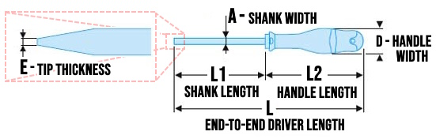

<!-- https://github.com/mcavallo-git/Coding/blob/main/hardware/screws-screwdrivers/slotted-standard_flathead-is-type-of-head_shape_dimensions-sizes.md -->

# Screw/Screwdriver Dimensions, Sizes

***

- |  | <h2>`Slotted` (aka `Standard`) Screws & Drive Tools</h2> |
  | -----------------------------------------------------------------------------: | -------------------------------------------------------: |
  ***
  - ### Word of Warning
    - ✅ The adjective `slotted` (or `standard`) describes screws whose drive type is a simple line across the diameter of the screw head
    - ⚠️ A common colloquialism exists which <u>***incorrectly***</u> uses the adjective `flat head` to describe a `slotted` screw
      - 

<i>💬 Show/Hide Details</i>

        - The prevalence of this misnomer drives the importance of understanding what a `flat head` screw *actually* defines
        - ✅ The adjective `flat head` defines a specific screw head/shank geometry which, once driven in, results in the screw head being fully flush ("flat") with the surface it was driven into (e.g. The screw doesn't stick out at all once it is screwed in)
          
        - Therefore, when discussing screws (and not just drivers), it is best to avoid usage of the term `flat head` unless you're explicitly describing how flush a screw should mate with whatever it is being driven into
        

  ***
  - ### Measuring a Slotted Screwdriver
      
      - ⚠️ TO DO ⚠️ Add `Blade Length` to the slotted screwdriver dimensions image (which measures the length of the sloped blade ("tip") of a slotted screwdriver - e.g. the length/distance from the start of the sloped tip of the blade until the very end/tip of the blade/screwdriver
      ***
      - #### <u>3-Component</u> Slotted Screwdriver Dimension Notation
        - Syntax:
          - `Tip Thickness` x `Shank Width` x `Shank Length`
        - Example:
          - [`0.8 x 4.0 x 100mm`](https://www.amazon.com/s?k=0.8+x+4.0+x+100mm+Slotted+Screwdriver)
      ***
      - #### <u>2-Component</u> Slotted Screwdriver Dimension Notation
        - Syntax:
          - `Tip Width` x `Shank Length`
        - Example:
          - [`1/8" x 4"`](https://www.amazon.com/s?k=1%2F8%22+x+4%22+Slotted+Screwdriver)
        - ##### Troubleshooting: Determining `Tip Thickness` from 2-Component Notation Dimensions
          - Note: If only two dimension values are given, then `Tip Thickness` has been excluded from the stated dimensions. This is commonly done for `ISO 2380-1` compliant screwdrivers
          - ***IF*** the driver is determined to be `ISO 2380-1` compliant:
            - Use `Table 1` from `ISO 2380-1` (below) to perform a reverse lookup of the `Tip Thickness` by first locating the known `Tip Width`, then getting the value for the corresponding `Tip Thickness` (in the same row)
  ***
  - Example Reference: [(AN3,5x250)-Protwist Slotted Screwdriver-3.5x250mm](https://www.ultimategarage.com/shop/part.php?products_id=7696)
     
    - 
  ***
  - ### Size Chart - `Screwdrivers for Slotted Head Screws`
    - In [ISO 2380-1](https://cdn.standards.iteh.ai/samples/35869/8172b254f966470ab774a4c0a99231a2/ISO-2380-1-2004.pdf), refer to:
      - `Table 1 - Hand-operated screwdriver tips, forms A and B`
      - `Table 2 - Machine-operated screwdriver tips, Form C`
    - | Slotted Size # | Tip Width (Metric) | Tip Thickness (Metric) |
      | -------------: | ----------------------: | --------------------------: |
      |          `SL2` |                `2.0 mm` |                    `0.4 mm` |
      |        `SL2.5` |                `2.5 mm` |                    `0.4 mm` |
      |          `SL3` |                `3.0 mm` |                    `0.5 mm` |
      |          `SL4` |                `4.0 mm` |                    `0.5 mm` |
      |          `SL3` |                `3.0 mm` |                    `0.6 mm` |
      |        `SL3.5` |                `3.5 mm` |                    `0.6 mm` |
      |        `SL4.5` |                `4.5 mm` |                    `0.6 mm` |
      |          `SL4` |                `4.0 mm` |                    `0.8 mm` |
      |        `SL5.5` |                `5.5 mm` |                    `0.8 mm` |
      |        `SL4.5` |                `4.5 mm` |                    `1.0 mm` |
      |        `SL5.5` |                `5.5 mm` |                    `1.0 mm` |
      |          `SL6` |                `6.0 mm` |                    `1.0 mm` |
      |        `SL6.5` |                `6.5 mm` |                    `1.2 mm` |
      |          `SL8` |                `8.0 mm` |                    `1.2 mm` |
      |          `SL8` |                `8.0 mm` |                    `1.6 mm` |
      |         `SL10` |               `10.0 mm` |                    `1.6 mm` |
      |         `SL12` |               `12.0 mm` |                    `2.0 mm` |
      |         `SL14` |               `14.0 mm` |                    `2.5 mm` |
    ***
  - ### Size Chart - `Slot Drive Tool & Screw Sizes`
    - | Slotted Size # | Tip Width (SAE) | Tip Width (Metric) |
      | ------------------: | -------------------: | ----------------------: |
      |               `0–1` |              `3/32"` |               `2.38 mm` |
      |                 `2` |               `1/8"` |               `3.18 mm` |
      |                 `3` |              `5/32"` |               `3.97 mm` |
      |               `4–5` |              `3/16"` |               `4.76 mm` |
      |               `6–7` |               `1/4"` |               `6.35 mm` |
      |              `8–10` |              `5/16"` |               `7.94 mm` |
      |             `12–14` |               `3/8"` |               `9.53 mm` |
      |             `16–18` |              `7/16"` |              `11.11 mm` |
      |             `18–24` |               `1/2"` |              `12.70 mm` |
  ***
  - ## Citation(s)
    - [books.google.com | Popular Mechanics](https://books.google.com/books?id=R2YEAAAAMBAJ&pg=PA82#v=onepage&q&f=false)
    - [cdn.standards.iteh.ai | ISO-2380-1-2004.pdf](https://cdn.standards.iteh.ai/samples/35869/8172b254f966470ab774a4c0a99231a2/ISO-2380-1-2004.pdf)
    - [docs.rs-online.com | The Catalogue - Wera](https://docs.rs-online.com/736a/A700000008591758.pdf)
    - [en.wikipedia.org | List of screw drives](https://en.wikipedia.org/wiki/List_of_screw_drives)
    - [makezine.com | Quick Tip: Know Your Screwdrivers (Hint: It's Not a "Flathead!")](https://makezine.com/article/workshop/quick-tip-know-your-screwdrivers-hint-its-not-called-a-flathead/)
    - [www.garagejournal.com | cabinet tip screwdriver](https://www.garagejournal.com/forum/threads/cabinet-tip-screwdriver.82051/#post-1184619)
    - [www.garagesanctum.com | Flat Head Screwdriver Sizes Chart](https://www.garagesanctum.com/size-chart/screwdriver-sizes-chart/#ftoc-heading-1)
    - [www.garagetooladvisor.com | Parts of a Screwdriver (with Diagram)](https://www.garagetooladvisor.com/hand-tools/parts-of-a-screwdriver-diagram/)
    - [www.garagetooladvisor.com | Screwdriver Sizes Guide (with Charts)](https://www.garagetooladvisor.com/hand-tools/screwdriver-sizes/)
    - [www.instructables.com | Types of Screw Heads/Screw Drives](https://www.instructables.com/Types-of-Screw-Heads/)
    - [www.linkedin.com | Types of Screw Heads and Their Uses](https://www.linkedin.com/pulse/types-screw-heads-uses-%C3%BCnal-sevim)
    - [www.monsterbolts.com | Common Fastener Abbreviations](https://monsterbolts.com/pages/abbreviations)
    - [www.reddit.com | Insulated screwdrivers : electricians](https://www.reddit.com/r/electricians/comments/1m664c/comment/cc6nlxq)
    - [www.toolcobber.com | Screwdriver Bits - The Ultimate Guide](https://www.toolcobber.com.au/power-tools/drilling/accessories/screwdriver-bits/)
    - [www.urreaprofessionaltools.com | Driver Tools - URREA](https://www.urreaprofessionaltools.com/catalog/07drivers.pdf)
    - [www.wihatools.com | Wiha Slotted Screwdriver and Bit Sizes](https://www.wihatools.com/pages/slotted-sizes)
    - [www.wonkeedonkeetools.co.uk | What are the parts of a screw?](https://www.wonkeedonkeetools.co.uk/screws/what-are-the-parts-of-a-screw)
    - [www.bahco.com | ERGO VDE Insulated Slotted Screwdrivers with 3-Component Handle 2.5 mm-12 mm](https://www.bahco.com/int_en/ergotm-vde-insulated-slotted-screwdrivers-with-3-component-handle-2-5-mm-12-mm-pb_be-8010s---be-8065s_.html#technical-details)

***
